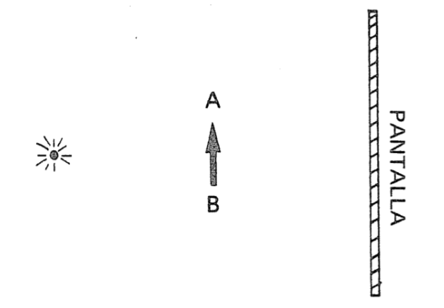
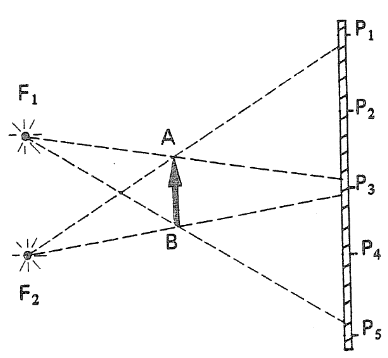
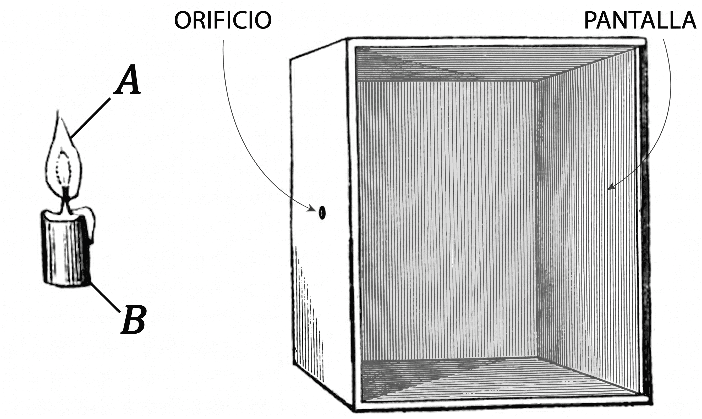
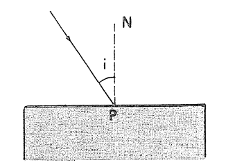
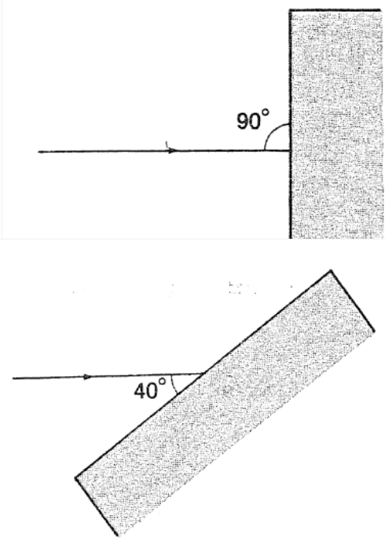
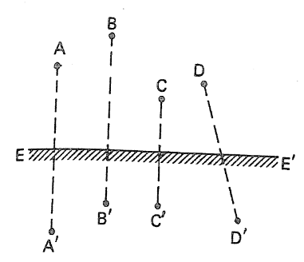
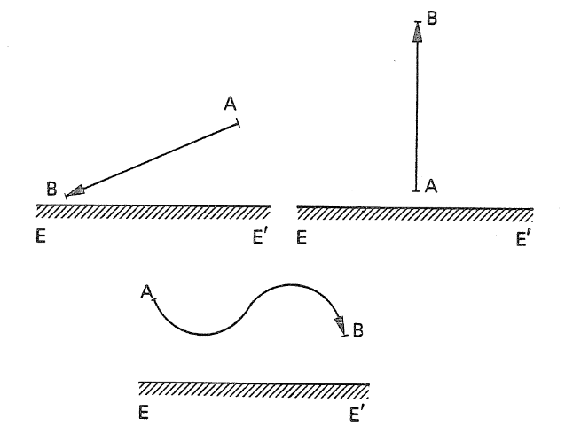
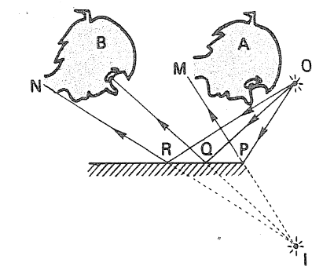

## 🌙 Luz y sombras

1.
1.  **¿Es correcto afirmar que la Luna es una fuente de luz?**
1.  **Entonces, ¿cómo es que podemos observarla?**

1.  La figura muestra un objeto $AB$ colocado frente a una **pequeña lámpara encendida**.  
    Detrás del objeto hay una **pantalla opaca**, situada paralelamente a $AB$.

1.  **Trace en la figura la sombra** $A'B'$ del objeto proyectada sobre la pantalla.
1.  **Indique la región del espacio que queda a oscuras**, es decir, la zona que no recibe luz de la fuente.
1.  Si el objeto se acerca a la fuente de luz, **¿cómo cambia el tamaño de la sombra?**  
    (aumenta, disminuye o permanece igual). **Justifique con un diagrama.**

  
 _Figura 2. Formación de sombra con una fuente puntual y un objeto opaco._

3.  En el ejercicio anterior, suponga que la **fuente de luz se aleja considerablemente**.

1.  **¿Cómo es el haz de rayos luminosos** que llega al objeto?
1.  Dibuje la sombra sobre la pantalla. **¿Es mayor, menor o igual que el objeto?**

1.  Dos fuentes luminosas $F_1$ y $F_2$ iluminan un objeto opaco $AB$.  
    Considerando la **propagación rectilínea de la luz**:

1.  **¿Qué puntos reciben luz de ambas fuentes?**
1.  **¿Qué puntos reciben luz solo de $F_1$?**
1.  **¿Qué puntos reciben luz solo de $F_2$?**
1.  **¿Qué puntos no reciben luz de ninguna fuente?**

  
 _Figura 4. Regiones de sombra y penumbra con dos fuentes luminosas._

5.  Una **cámara oscura** consiste en una caja cerrada con un pequeño orificio.  
    Un objeto luminoso (como una vela) proyecta una imagen en la pared opuesta.

1.  **Trace los rayos de luz** desde los extremos de la vela que pasan por el orificio hasta la pantalla.
1.  **Relacione el tamaño del orificio con la formación de penumbra.**  
    Justifique con un esquema para un orificio mayor.

  
 _Figura 5. Formación de imágenes en una cámara oscura._

---

## 🔁 Reflexión de la luz

1.  Un rayo de luz incide sobre una superficie reflejante ($NP$ es la normal).

1.  **Trace el rayo reflejado.**
1.  **Indique el ángulo de reflexión** $\hat{r}$.
1.  Si $\hat{i} = 32^\circ$, **¿cuánto vale $\hat{r}$?**

  
 _Figura 1. Ley de la reflexión de la luz._

2.  Para cada superficie reflejante:

1.  **Trace la normal** en el punto de incidencia.
1.  **Determine el ángulo de incidencia.**
1.  **Determine el ángulo de reflexión.**
1.  **Trace el rayo reflejado.**

  
 _Figura 2. Aplicación de la ley de la reflexión._

3.
1.  Una persona está a $2\,\text{m}$ de un espejo plano.  
    **¿Cuál es la distancia entre la persona y su imagen?**

1.  Si se acerca al espejo,  
    **¿cambia el tamaño de la imagen?**

1.  La figura muestra un espejo plano $EE'$ y pares de puntos.  
    **Indique cuáles representan un objeto y su imagen.**

  
 _Figura 4. Identificación de imágenes en espejos planos._

5.  **Trace la imagen** $A'B'$ del objeto $AB$ en el espejo plano $EE'$.

  
 _Figura 5. Construcción de imágenes en espejos planos._

6.  **Explique por qué el observador $A$ no ve la imagen $I$ del objeto $O$.**

  
 _Figura 6. Condiciones de visibilidad en espejos planos._
